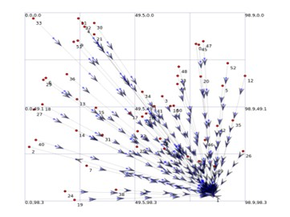
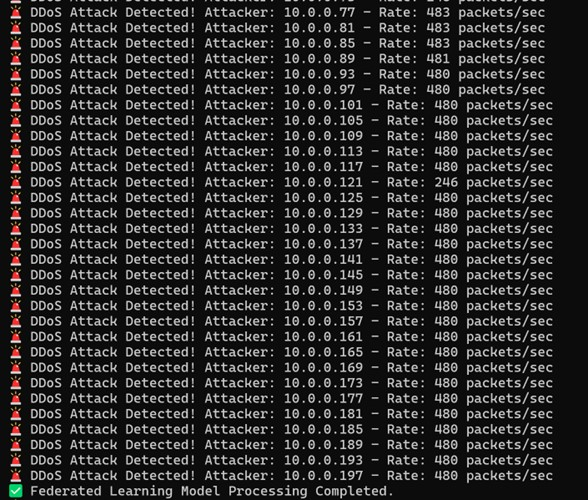

# Federated-Learning-Based-Intrusion-Detection-System-IDS-for-IoT-Networks
# 🛡️ Federated Learning-Based IDS for IoT using NS-3 and LSTM

This project simulates a **Federated Learning (FL)**-based **Intrusion Detection System (IDS)** for IoT networks using **NS-3** and **NetAnim**. It detects **DDoS attacks** in real-time using a **Long Short-Term Memory (LSTM)** based model, trained in a decentralized manner using the **Federated Averaging (FedAvg)** algorithm.

## ✨ Features
- **DDoS Attack Simulation in NS-3**: Emulates IoT communication and malicious traffic.
- **Network Visualization with NetAnim**: Animates how the attack spreads and how packets flow.
- **Federated Learning Framework**: Distributed training on simulated IoT nodes.
- **LSTM-based Model**: Learns to detect attacks based on network traffic patterns.

---

## 🚀 Getting Started

### 🧰 Prerequisites
- Python 3.7+
- PyTorch (for LSTM and FL model)
- NumPy, Pandas, Matplotlib
- NS-3 (tested with v3.36+)
- NetAnim (bundled with NS-3)

---

### 🔧 Installation

1. **Clone the Repository**
   ```bash
   git clone https://github.com/yourusername/fl-ids-ns3
   cd fl-ids-ns3
   
2. **Install Python Dependencies**
  ```bash
  pip install -r requirements.txt
```
## How It Works

### 1. DDoS Traffic Simulation (NS-3)
- Simulates an IoT network with devices, a server, and malicious nodes.
- Attackers launch DDoS via UDP floods and TCP SYN floods, overwhelming the server.
- Legitimate traffic gets delayed or dropped.

### 2. Packet Capture & Feature Extraction
- NS-3 captures network traffic using built-in tools.
- Extracts features like packet counts, IP frequency, protocols, and timings.
- Prepares structured datasets for model training.

### 3. Federated Learning with LSTM
- Each IoT node trains a local LSTM model on its own data (time-series traffic patterns).
- Nodes share only model parameters, preserving data privacy.
- FedAvg algorithm averages weights to create a global model shared across nodes.

### 4. Real-Time Intrusion Detection
- The global LSTM model analyzes incoming traffic sequences.
- Detects abnormal patterns indicating DDoS attacks.
- Flags attacks for mitigation.

### Why This Approach?
| Traditional IDS       | Federated Learning IDS      |
|----------------------|-----------------------------|
| Centralized data      | Data stays local (privacy)   |
| Limited scalability   | Scalable across devices      |
| Static retraining     | Adaptive, real-time learning |
| High resource usage   | Lightweight for IoT devices  |


## 🖼️ Demo Snapshots

<table>
  <tr>
    <td align="center"><strong>NetAnim Simulation (DDoS Attack)</strong></td>
    <td align="center"><strong>DDoS Detection by FL LSTM</strong></td>
  </tr>
  <tr>
    <td></td>
    <td></td>
  </tr>
</table>


**Academic Acknowledgement**
This is a simulation project done as an experimental learning activity under the Cryptography and Network Security course. It was guided by our faculty to explore modern intrusion detection techniques using machine learning and federated computing.


  
